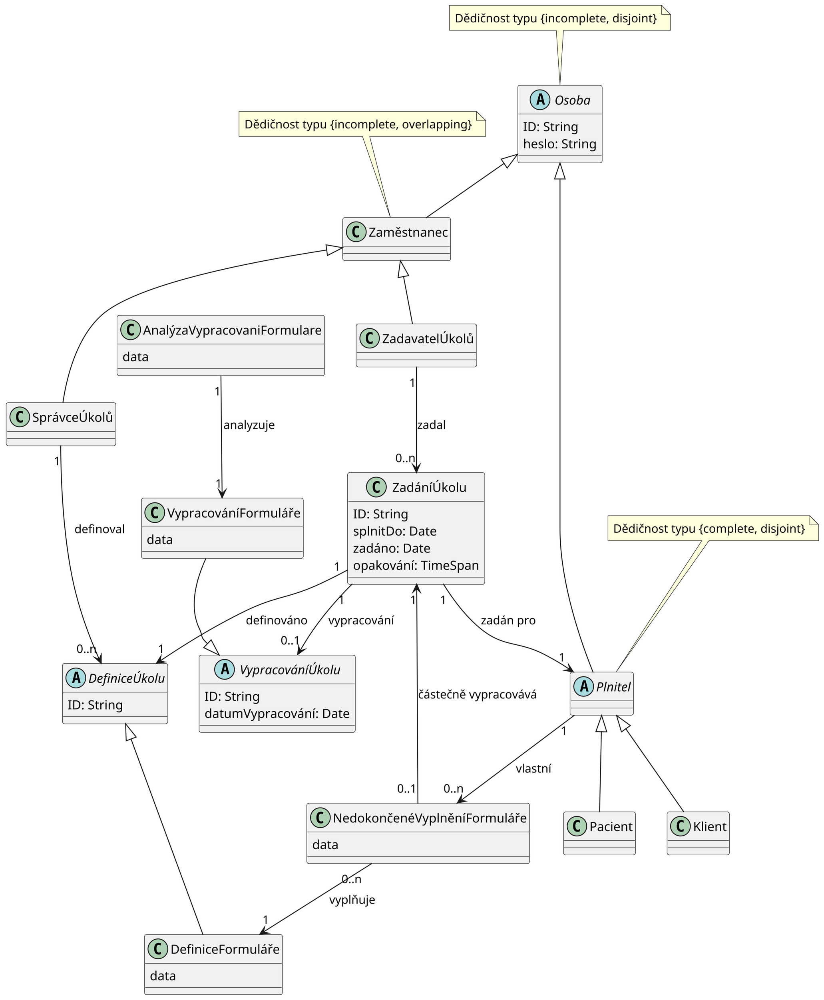

# Analýza požadavků

Pro analýzu požadavků proběhlo několik online schůzek s pracovníky Národního
ústavu duševního zdraví. Na úvodní schůzce se probíraly možnosti využití
výpočetních technologií v oblasti duševního zdraví. Na této schůzce jsme se
shodli na tvorbě platformy pro digitalizaci práce s dotazníky. Na následujících
schůzkách byly zadavateli kladeny otevřené otázky týkající se představ o
fungování aplikace. Také byly získávány informace o stakeholderech, omezeních a
IT infrastruktuře zadavatele. Podařilo se také získat ukázkový dotazník, který
by měla aplikace zvládnout zpracovat. Ukázkový dotazník lze najít
[zde](./ukazkovy-dotaznik).

## Stakeholdeři a jejich zájmy

Tato sekce popisuje stakeholdery a jejich zájmy, které byly identifikovány během
analýzy požadavků. Stakeholdeři jsou rozděleni do následujících skupin:
uživatelé aplikace, vývojáři, provozovatel software, vedení organizace. Skupina
uživatelů aplikace je rozdělena i na podskupiny pro zachycení většího detailu.
Uživatelské role jsou podrobněji definovány a popsány dále v
sekci [Specifikace](#specifikace).

### Uživatelé aplikace

-   Podpora mobilních zařízení.

#### Plnitelé dotazníků

-   Jednoduché rozhraní pro plnění úkolů, které zajistí zlepšení jejich
    zdravotního stavu a poskytne terapeutům potřebné informace pro jejich léčbu.

#### Terapeuti

-   Jednoduché rozhraní vhodné pro uživatele s nízkými technickými znalostmi.
-   Jednoduchý přístup k výsledkům pacientů s přehlednou vizuální reprezentací.
-   Spolupráce s plniteli v rámci terapie formou domácích úkolů pro zlepšení
    poskytované péče a prevenci kriminality.

#### Výzkumníci

-   Možnost tvorby komplexních výzkumných studií.
-   Možnost pokročilé analýzy dat vlastním nástrojem.

### Vývojáři

-   Dobře dokumentovaný kód a vhodně dokumentovaná architektura aplikace.
-   Dobře nastavené procesy pro prevenci chyb jako jsou testy, kontinuální
    integrace, apod.
-   Jednoduchá rozšiřitelnost aplikace.
-   Vysoká modifikovatelnost aplikace.

### Provozovatel software

-   Jednoduché nasazení aplikace na server.
-   Schopnost monitorování aplikace.

### Vedení organizace

-   Nízká cena za vývoj a provoz aplikace.
-   Nízké časové nároky na zaučení plnitel.
-   Vysoké zabezpečení aplikace.

## Specifikace

Tato sekce obsahuje neformální specifikaci požadavků na aplikaci. Soupis
požadavků byl od začátku vývoje organizován do kategorií. Organizace požadavků
byla ponechána v původní podobě. Požadavky jsou rozděleny do čtyř kategorií:
funkční požadavky, nefunkční požadavky, nasazení a monitoring. Pro účely tohoto
dokumenty byly požadavkům přiřazeny identifikátory. Funkční požadavky jsou
označeny R-FR-ID, nefunkční požadavky R-NR-ID, požadavky na nasazení R-DR-ID a
požadavky na monitoring R-MR-ID, kde ID je číslo požadavku z dané kategorie.
Požadavky na monitoring jsou označeny R-MR-ID a požadavky na nasazení R-DR-ID,
kde ID je opět číslo požadavku z dané kategorie. Mnoho požadavků pracuje s
uživatelskými rolemi, které jsou definovány v požadavku [R-NR-1](#r-nr-1).
Specifikace vznikla v rané fázi vývoje a některé požadavky byly později změněny.
Změny jsou popsány v sekci [Změny specifikace](#zmeny-specifikace).

### Funkční požadavky

#### R-FR-1

Zadavatel/správce dotazníků může zadávat dotazníky a úkoly konkrétnímu plniteli,
nastavit frekvenci opakování a nastavit start/deadline.

    -   Start je čas, kdy lze dotazník nejdříve vyplnit.
    -   Deadline je čas, kdy lze dotazník nejpozději vyplnit. Deadline
        může být dvou typů: striktní a uvolněný. V případě nastavení
        striktního deadline *nelze* po uplynutí deadline dotazník
        vyplnit. V případě nastavení uvolněného deadline *lze* dotazník
        vyplnit i po uplnutí deadline.
    -   Dotazník se skládá z otázek, které mohou přijímat odpovědi
        těchto typů:
        -   text
        -   více možností (možno zvolit právě jeden)
        -   více možností (možno zvolit libovolný počet)
    -   U každé otázky je možno nastavit podmíněné zobrazení. Jinak
        řečeno, otázka se plniteli zobrazí, pokud je splněna podmínka
        definovaná správcem dotazníku při vytvoření.

#### R-FR-2

Správce dotazníků je schopen vytvářet/mazat dotazníky a způsoby vyhodnocení

#### R-FR-3

Správce dotazníků může v dotazníku upravit obsah otázek a možných odpovědí v
případě, že se jedná o volbu z možností. _Nelze_ přidat/odebrat otázky,
přidat/odebrat možné odpovědi, ani upravit způsob výpočtu skóre.

    -   Při tvorbě dotazníku je možno nastavit automaticky počítané
        metriky pomocí vzorce (např. `otázka1 + otázka2 - otázka4`, kde
        `otázka1`, `otázka2` a `otázka4` jsou proměnné reprezentující
        výsledky příslušných otázek).

#### R-FR-4

Plnitel může v aplikaci vypracovat dotazníky a úkoly, které mu byly přiděleny
správcem/zadavatelem dotazníků.

#### R-FR-5

Plnitel je schopen vyplnit část dotazníku, uložit si dosud zodpovězené otázky a
v budoucnu vyplňování dotazníku dokončit i na jiném zařízení.

#### R-FR-6

Plnitel může smazat svá data.

#### R-FR-7

Správce/zadavatel dotazníků je schopen vidět výsledky dotazníků a úkolů všech
plnitelů.

#### R-FR-8

Správce/zadavatel může vybrat data, která budou vizualizována na grafech.

#### R-FR-9

Správce dotazníků/člen technické podpory je schopen vytvářet/mazat účty
plnitelů, účty pro ostatní správce a účty pro zadavatele dotazníků.

#### R-FR-10

Správce dotazníků/člen technické podpory je schopen měnit přístupová práva všech
ostatních účtů.

#### R-FR-11

Plintel je schopen měnit heslo svého účtu a je schopen svůj účet smazat.

#### R-FR-12

Výsledky dotazníků plnitelů může správce/zadavatel dotazníků z aplikace
exportovat do formátu CSV.

#### R-FR-13

Aplikace bude pouze v Českém jazyce, ale bude připravena na internacionalizaci.

#### R-FR-14

Plnitel v systému vystupuje pod ID, které je náhodně vygenerováno.

#### Viditelnost vyhodnocení dotazníků

##### R-FR-15

Plnitel je schopen vidět vyhodnocení svých dotazníků, u kterých to správce
povolil.

##### R-FR-16

Správce dotazníků může dovolit plniteli vidět výsledky konkrétního dotazníku -
číselná hodnota/graf/text.

##### R-FR-16

Viditelnost výsledků lze nastavit následujícími způsoby:

    -   plnitel vidí výsledky
    -   plnitel nevidí výsledky
    -   plnitel vidí výsledky pouze, pokud výsledek dotazníku splňuje
        podmínku (např. výsledné skóre je větší než 10)

#### Volitelné

Požadavky z této podsekce nejsou kritické pro fungování aplikace, ale mohou
zjednodušit užívání aplikace.

##### R-FR-18

Sledování délky času stráveného nad jednotlivými otázkami, času, kdy plnitel
dotazník vyplnil, počtu změn odpovědí.

##### R-FR-19

E-mail upozornění na nové úkoly, na nesplněné úkoly.

##### R-FR-20

Push notifikace v prohlížeči na nové úkoly, na nesplněné úkoly.

### Nefunkční požadavky

#### R-NR-1

V systému vystupují uživatelé s následujícími rolemi:

    -   Plnitel = pacient/klient
    -   Zaměstnanci NUDZ
        -   Správce dotazníků = terapeut/výzkumník
        -   Zadavatel dotazníků = terapeut/výzkumník
    -   Technická podpora

#### R-NR-2

Uživatelské rozhraní by mělo být vhodné pro uživatele s nízkými technickými
znalostmi.

#### R-NR-3

K programu by měla být dodána uživatelská a technická dokumentace.

Aplikace bude maximalizovat použití již existujícího software, pro snížení ceny,
časové náročnosti a zjednodušení následné údržby.

### Nasazení

#### R-DR-1

Aplikace bude spouštěna v kontejneru.

#### R-DR-2

Aplikace poběží na serveru s následujícími parametry: (lze domluvit navýšení v
případě potřeby)

    -   CPU: 2 jádra

    -   RAM: 4 GB

    -   HDD: volných 29 GB

### Monitoring

#### R-MR-1

Bude k dispozici rozhraní pro monitorování aplikace.

### Změny specifikace

V průběhu vývoj se ukázalo, že některé požadavky popsané v
sekci [1.2.1.1](#subsubsec:viditelnost-vyhodnoceni-dotazniku) je potřeba
pozměnit. Tato podsekce popisuje všechny provedené změny.

Původní specifikace pracovala s možností nastavení viditelnosti vyhodnocení
dotazníků. Toto bylo pokryto požadavky [R-FR-15](#r-fr-15), [R-FR-16](#r-fr-16)
a [R-FR-17](#r-fr-17). Možnost s nastavením viditelnosti na základě splnění
podmínky byla zavrhnuta z následujícího důvodu. Pokud by plnitel neviděl
vyhodnocení dotazníku, tak by si mohl odvodit, že výsledek dotazníku je
nepříznivý. Toto zjištění by mohlo mít negativní vliv na jeho zdravotní stav.
Možnost nastavit vyhodnocení dotazníku jako vždy viditelné pro plnitele bylo
zavrhnuto ze stejného důvodu. Vyhodnocení složitějších dotazníků navíc může
správně interpretovat pouze odborník.

Původně bylo zamýšleno, že si plnitelé budou přímo schopni smazat svá data.
Vzhledem k tomu, že některá data budou určena pro výzkumné účely, což může
vyžadovat nutnost archivace, tak není vhodné umožnit plnitelům přímo smazat svá
data. Bylo tedy rozhodnuto, že plnitelé budou moci o smazaní svých dat pouze
požádat skrze pracovníka NUDZ. Každý požadavek bude pak posouzen individuálně.

## Doménový model

Na základě schůzek a specifikace ze sekce [Specifikace](#specifikace) jsme
vytvořili doménový model. Model byl následně konzultován s pracovníky NUDZ a byl
schválen. Model je popsán diagramem na obrázku níže. Jednotlivé entity jsou
definovány níže. Omezení kladené na model, která nejsou vyjádřena v diagramu,
jsou popsána v sekci [1.3.1](#sbsec:omezeni).

### Doménový model formou Class diagramu v notaci [UML](https://www.omg.org/spec/UML/2.5.1/PDF)



Nyní přesněji definujeme jednotlivé entity vystupující v diagramu:

### Osoba

Lidská bytost, která má vztah k systému.

### Zaměstnanec

Osoba, která je zaměstnána v NUDZ.

### SprávceÚkolů

Zaměstnanec, který je zodpovědný za správu úkolů v systému.

### ZadavatelÚkolů

Zaměstnanec, který zadává pro plnitelé úkoly v systému.

### Plnitel

Osoba, která vypracovává úkoly v systému.

### Klient

Plnitel, který je klientem NUDZ (platí za poskytovanou péči).

### Pacient

Plnitel, který je pacientem NUDZ (poskytovaná péče je hrazena pojišťovnou).

### DefiniceÚkol

Obecný potenciálně znovupoužitelný popis činnosti plnitele.

### DefiniceFormuláře

Definice úkolu, která obsahuje formulář, který je určen k vyplnění plnitelem.

### ZadáníÚkolu

Zadání úkolu pro konkrétního plnitele na základě definice úkolu.

### VypracováníÚkolu

Vypracování úkolu plnitelem na základě zadání úkolu.

### VypracováníFormuláře

Vypracování úkolu ve tvaru vyplnění formuláře.

### AnalýzaVypracováníFormuláře

Odvozená data z vypracování formuláře, například výsledné skóre.

### NedokončenéVyplněníFormuláře

Částečné vyplnění formuláře.

### Omezení

Zde jsou vypsána omezení, která nejsou vyjádřena v diagramu. Každé omezení je
napsáno jak v neformální textové podobě, tak v
[Object constraint language](https://www.omg.org/spec/OCL/2.4/About-OCL).

#### NedokončenéVyplněníFormuláře

Nedokončené vyplnění formuláře pro definici formuláře, zadání úkolu a plnitele
může existovat pouze pokud je zadání úkolu pro plnitele a zadání úkolu zadává
stejný formulář, který je částečně vyplněn nedokončeným vyplněním formuláře.

```
context plnitel: Plnitel inv
    plnitel->vlastni->forAll(
        nedokonceneVyplneniFormulare |
            nedokonceneVyplneniFormulare
            ->castecneVypracovava
            ->zadanPro = self
            and
            nedokonceneVyplneniFormulare
            ->castecneVypracovava
            ->definovano = nedokonceneVyplneniFormulare->vyplnuje
            )
```

#### ZadáníÚkolu

Definice úkolu musí logicky odpovídat vypracování úkolu. Např. nemůžeme
považovat přečtení článku jako vypracování úkolu, který je definován jako
vypracování formuláře.

```
context z: ZadáníÚkolu inv
    if z.vypracování.oclIsKindOf(VypracováníFormuláře) then
        z.definováno.oclIsKidnOf(DefiniceFormuláře)
    endif
```

#### VypracováníÚkolu

ID musí být unikátní.

```
context v1, v2: VypracováníÚkolu inv v1.ID = v2.ID implies v1 = v2
```

#### DefiniceÚkolu

ID musí být unikátní.

```
context d1, d2: DefiniceÚkolu inv d1.ID = d2.ID implies d1 = d2
```

#### Osoba

ID musí být unikátní.

```
context o1, o2: Osoba inv o1.ID = o2.ID implies o1 = o2
```

## User stories

Zde je seznam požadavků ve sjednocené formě. Požadavky mají formu . Každý
požadavek má u sebe i cíl, jelikož může být důležitý pro porozumění požadavku a
může ovlivnit způsob implementace. Jedná se o přepis funkčních požadavků z
neformální specifikace ze sekce [Specifikace](#specifikace). Role uživatelů jsou
definovány v nefunkčním požadavku [R-NR-1](#r-nr-1) ve specifikaci. Tato sekce
pracuje již s změnami specifikace, které byly popsány v
sekci [Změny specifikace](#zmeny-specifikace). Každá položka má identifikátor ve
formátu R-US-ID, kde ID je číslo položky.

### R-US-1

Jako zaměstnanec chci mít možnost založit účet pro plnitele, abych mohl využít
systém v rámci terapie/výzkumu.

### R-US-2

Jako plnitel chci, aby moje data nemohli číst ostatní plnitelé, protože jsou
soukromá.

### R-US-3

Jako terapeut/výzkumník chci, aby byl plnitel schopen vidět/plnit jen úkoly,
které mu byly zadány, aby se zachovala integrita sbíraných dat.

### R-US-4

Jako plnitel chci být schopen zobrazit svá data, abych věděl co je o mě v
systému evidováno (např. vyplněné dotazníky).

### R-US-5

Jako správce dotazníků chci mít možnost zadávat dotazníky a úkoly konkrétnímu
plniteli, nastavit frekvenci opakování a nastavit start/deadline, abych mohl
správně koordinovat procesy a aktivity v systému.

### R-US-6

Jako správce dotazníků chci mít možnost vytvářet otázky v dotaznících, které
mohou přijímat odpovědi typu text, více možností (možno zvolit právě jeden) a
více možností (možno zvolit libovolný počet), abych mohl vytvářet různorodé a
komplexní dotazníky.

### R-US-7

Jako správce dotazníků chci mít možnost nastavit podmíněné zobrazení otázky,
takže otázka se plniteli zobrazí pokud je splněna podmínka definovaná při
vytvoření, což umožní flexibilní a přizpůsobené průzkumy.

### R-US-8

Jako správce dotazníků chci mít možnost vytvářet, mazat dotazníky a způsoby
vyhodnocení, abych mohl udržovat aktuální a relevantní soubor dotazníků.

### R-US-9

Jako správce dotazníků chci mít možnost nastavit automaticky počítané metriky
pomocí vzorce (např. `otázka1 + otázka2 - otázka4`), abych mohl efektivně
vyhodnocovat odpovědi.

### R-US-10

Jako plnitel chci mít možnost vypracovat dotazníky a úkoly, které mi byly
přiděleny správcem/zadavatelem dotazníků, abych mohl aktivně participovat v
systému.

### R-US-11

Jako plnitel chci mít možnost vyplnit část dotazníku, uložit si dosud
zodpovězené otázky a v budoucnu vyplňování dotazníku dokončit, aby bylo
vyplňování dotazníků flexibilní a pohodlné.

### R-US-12

Jako plnitel chci mít možnost smazat svá data, abych měl kontrolu nad svými
daty.

### R-US-13

Jako správce/zadavatel dotazníků chci mít možnost vidět výsledky dotazníků a
úkolů všech plnitelů a vybrat data, která budou vizualizována na grafech, abych
mohl monitorovat a analyzovat výsledky.

### R-US-14

Jako správce dotazníků/člen technické podpory chci mít možnost vytvářet/mazat
účty plnitelů, účty pro ostatní správce a účty pro zadavatele dotazníků, abych
mohl efektivně spravovat uživatelské účty.

### R-US-15

Jako správce/zadavatel dotazníků chci mít možnost exportovat výsledky dotazníků
plnitelů z aplikace do formátu CSV, abych mohl dělat pokročilé analýzy dat.

### R-US-16

Jako plnitel chci, aby k programu byla dodána uživatelská a technická
dokumentace, abych mohl lépe porozumět, jak aplikace funguje a jak ji používat.

### R-US-17

Jako technický pracovník chci, aby aplikace byla spouštěna v kontejneru, abych
mohl snadno spravovat a nasazovat aplikaci.

### R-US-18

Jako technický pracovník chci mít k dispozici rozhraní pro monitorování
aplikace, abych mohl sledovat výkon a stav aplikace a rychle reagovat na
potenciální problémy.

### R-US-19

Jako plnitel chci v systému vystupovat pod ID, které je náhodně vygenerováno,
aby bylo zajištěno mé soukromí.

### R-US-20

Jako správce dotazníků chci být schopen upravovat text již existující otázky,
abych mohl opravit překlepy nebo vylepšit formulaci otázky.

### R-US-21

Jako plnitel chci měnit heslo svého účtu, abych zajistil bezpečnost svého účtu.

### Volitelné

Požadavky z této podsekce nejsou kritické pro fungování aplikace, ale mohou
zjednodušit užívání aplikace.

#### R-US-25

Jako plnitel chci dostávat e-mail upozornění na nové úkoly a na nesplněné úkoly,
abych byl vždy informován o svých úkolech a termínech.

#### R-US-26

Jako plnitel chci dostávat push notifikace v prohlížeči na nové úkoly a na
nesplněné úkoly, abych byl vždy aktuálně informován o svých úkolech.

#### R-US-27

Jako výzkumník chci mít možnost sledovat chování uživatele při odpovídání na
otázky (např. délka času strávená nad jednotlivými otázkami, čas, kdy uživatel
dotazník vyplnil, počet změn odpovědí), abych mohl lépe porozumět výsledkům.
