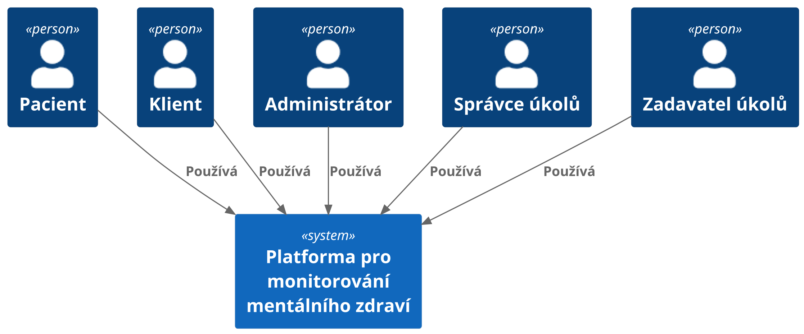
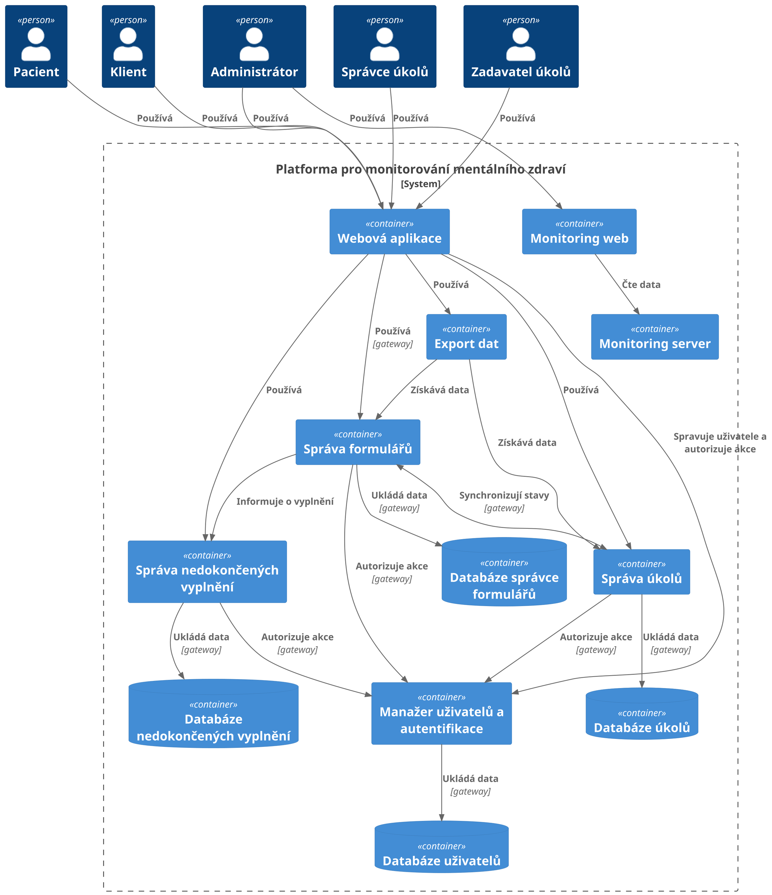
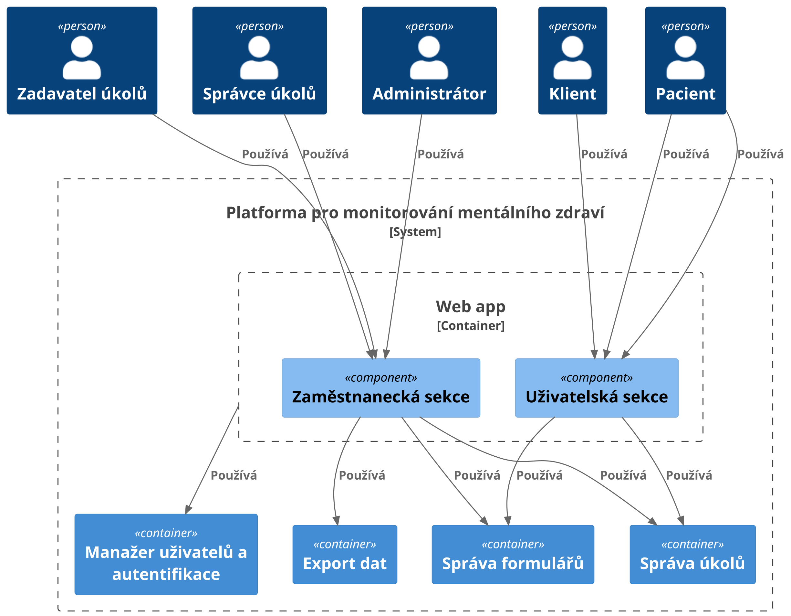
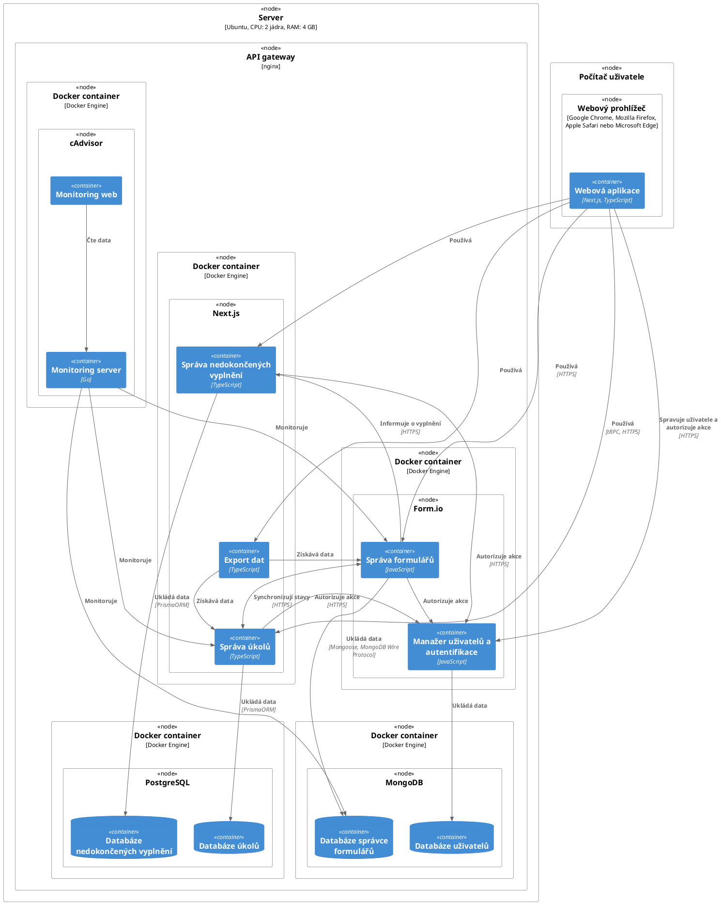
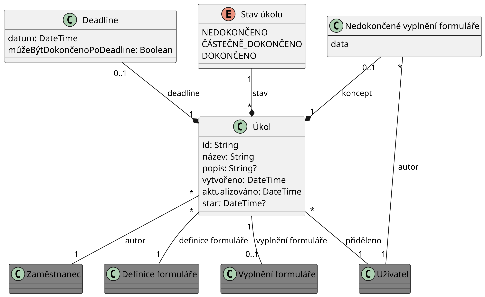
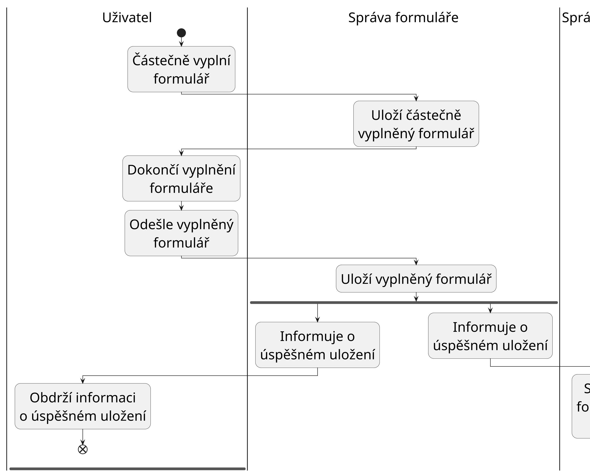

# Návrh aplikace

Tato kapitola popisuje, jak byla aplikace navržena. Nejprve popíšeme jakým
způsobem jsme se rozhodli řešit požadavky zadavatele v
sekci [Návrh řešení](#návrh-řešení). Poté navrhneme architekturu systému v
sekci [Architektura](#architektura). Následně se budeme věnovat návrhu
uživatelského rozhraní formou wireframů
(sekce [1.4](#sec:navrh-uzivatelskeho-rozhrani)). Následně popíšeme výběr
technologií (sekce [Výběr technologií](#výběr-technologií)) a způsob ukládání
dat v systému (sekce [Ukládání dat](#ukládání-dat)).

## Návrh řešení

Jedním z požadavků byla dostupnost aplikace jak na počítačích, tak na mobilních
zařízeních. Zvážili jsme dvě možnosti, jak tohoto dosáhnout. První možností je
vyvinout mobilní aplikaci a desktopovou aplikaci zvlášť. Druhou možností je
vyvinout webovou aplikaci s responzivním rozhraním, která bude dostupná na všech
zařízeních. Jelikož nepotřebujeme žádné nativní funkce zařízení, tak je
výhodnější vyvinout pouze jednu webovou aplikaci. Webová aplikace má také výhodu
v tom, že ji není potřeba instalovat a aktualizovat. Další výhodou řešení
webovou aplikací je, že zadavatel má zkušenosti s jejich provozem a má
existující infrastrukturu.

Řešení webovou aplikací vyžaduje vývoj webové stránky a serveru. Nároky na
uživatelské rozhraní jsou v dnešní době velmi vysoké. Rozhraní musí být rychlé,
responzivní a intuitivní. V případě serveru je potřeba se zaměřit zejména na
návrh rozhraní a bezpečnost. Budeme se snažit použít co nejvíce již existujícího
software, jak bylo zadáno v požadavku [R-NR-4](#analyza-pozadavku#r-nr-4) Naším
cílem bude vybrat software, který nám dá dostatek flexibility a zároveň bude
dostatečně stabilní a udržitelný.

## Architektura

Nyní navrhneme architekturu aplikace. Budeme využívat architekturu typu
klient-server. Klientem bude webová aplikace, která bude spuštěna ve webovém
prohlížeči uživatele. Serverová část bude mít distribuovanou architekturu,
jelikož bude využívat službu Form.io. Pro popis architektury použijeme
[C4 model](https://c4model.com/) a zaměříme se na 3 úrovně abstrakce - kontext,
kontejnery a komponenty.

### Kontext

Začneme kontextovou vrstvou, která zobrazuje vztahy mezi naším systémem, jeho
uživateli a ostatními systémy.

#### C4 model - Systémový kontext

### Kontejnery

Nyní popíšeme dekompozici našeho systému na kontejnery a vztahy mezi nimi.
Aplikace byla rozdělena na kontejnery primárně na základě logické souvislosti
funkcionalit, které poskytují. U většiny kontejnerů je zřejmý jejich účel.
Některé však vyžadují bližší popis, který se nachází níže.

#### C4 model - Kontejnery

Pokud je vztah mezi dvěma kontejnery vyznačený jako gateway, znamená to, že
komunikace probíhá skrze prostředníka, který poskytuje vrstvu abstrakce. Gateway
snižuje provázanost komunikujících systémů (coupling) a zajišťuje
modifikovatelnost. Bližší informace o tomto vzoru lze nalézt v
[článku Gateway](https://martinfowler.com/articles/gateway-pattern.html) od
Martin Fowler.

Monitoring server monitoruje všechny ostatní kontejnery. Relace byly vynechány
pro zachování čitelnosti diagramu.

#### Správa formulářů

Tento kontejner poběží na serveru a bude umožňovat CRUD operace nad definicemi
formulářů. Také bude poskytovat rozhraní pro sběr dat z formulářů a jejich
export.

#### Správa úkolů

Tento kontejner poběží na serveru a bude umožňovat CRUDoperace nad úkoly.

#### Správa nedokočených vyplnění

Tento kontejner se bude starat o ukládání nedokončených vyplnění formulářů.
Tento kontejner bude ve své podstatě fungovat jako uložiště typu klíč-hodnota,
kde klíčem je identifikátor formuláře a hodnotou jsou nedokončená vyplnění. Pro
zachování jednoduchosti systému nebude kontejner posílat požadavky na kontejner
pro správu formulářů. Kontejner tedy nebude validovat existenci formuláře pro
který je nedokončené vyplnění ukládáno ani nebude kontrolovat, zda-li
nedokončené vyplnění obsahuje validní data. Přístup ke všem operacím, které
tento kontejner poskytuje, dostanou pouze plnitelé úkolů, což je skupina
uživatelů definovaná v požadavku [R-NR-1](./analyza-pozadavku#r-nr-1). Způsob
ukládání dat, které vlastní tento kontejner, je popsán v
sekci [Správa dat o nedokončených vyplnění formulářů](#správa-dat-o-nedokončených-vyplnění-formulářů).

#### Export dat

Pro export sesbíraných dat z aplikace potřebujeme získat data o úkolech a
odevzdání formulářů. Každý úkol spojíme s odevzdáním, které bylo vytvořeno v
rámci splnění tohoto úkolu. Data o úkolech a odevzdání však vlastní dvě různé
služby. Spojení dat můžeme provést na klientovi a nebo na serveru. Obě varianty
jsou možné. Umístění procesu spojení na server zajistí lepší interoperabilitu
našeho systému s ostatními systémy a umožní programově řídit export dat z
aplikace.

Pro tyto účely byl vytvořen speciální kontejner jehož úkolem je získat data z
ostatních služeb a spojit je. Jelikož export dat nebude probíhat příliš často a
sesbíraná data budou poměrně malá (očekáváme maximálně řádově stovky záznamů),
není nutné dbát na vysokou výkonnost této služby.

Máme několik možností implementace této služby. První možností je použití
návrhového vzoru
[API composition](https://microservices.io/patterns/data/api-composition.html).
Tento vzor pracuje se spojením uvnitř operační paměti. Implementace tohoto vzoru
je velmi jednoduchá, ale spojení dat může být neefektivní. Druhou možností je
použití návrhového vzoru
[Command query responsibility segregation](https://microservices.io/patterns/data/cqrs.html).
Tento vzor využívá repliky dat z obou datových zdrojů. Tato možnost je
efektivnější, ale složitější na implementaci.

Z vlastností obou možností je vidět, že API composition je vhodnější řešení
našeho problému. Finální implementace byla realizována vytvoření tRPC routeru v
rámci NextJS aplikace.

### Komponenty

Dělení na komponenty popíšeme pouze pro kontejner _Webová aplikace_. Tento
kontejner rozdělíme na zaměstnaneckou a uživatelskou sekci.

#### C4 model - Komponenta webová aplikace

## Nasazení

Na obrázku níže je znázorněn diagram nasazení pomocí notace
[C4 modelu](https://c4model.com/#DeploymentDiagram). Diagram obsahuje i použité
technologie. Odůvodnění výběru těchto technologií je popsáno v
sekci [Výběr technologií](#výběr-technologií). Všechny komponenty jsou nasazeny
na jediný server, jak bylo požadováno v zadání v sekci [Nasazení](#nasazení).
Pro snížení počtu nasazených Docker kontejnerů byly kontejnery Databáze
nedokončených vyplnění a Databáze úkolů nasazeny na jednu instanci databáze.
Implementace dovoluje i nasazení těchto komponent na různé instance databáze.

### Diagram nasazení

## Návrh uživatelského rozhraní

Jak již víme z [Analýzy požadavků](./analyza-pozadavku), budeme potřebovat
navrhnout rozhraní pro plnitele úkolů a také pro terapeuty. Předpokládáme, že
všichni uživatelé aplikace mají nízké technické dovednosti a proto se budeme
snažit navrhnout co nejjednodušší rozhraní. Abychom předešli vývoji rozhraní,
které by zadavatel nepovažoval za vhodné, tak vytvoříme wireframy, které necháme
zadavatelem schválit. Výsledné wireframy naleznete [zde](./wireframes).

## Výběr technologií

V této sekci se budeme zabývat výběrem konkrétních technologií, které budeme
používat při vývoji aplikace. Chceme volit populární a vyspělé nástroje, jelikož
programátoři, kteří budou aplikaci v budoucnu rozšiřovat, je pravděpodobně budou
znát. Zároveň také chceme co nejméně komplikovat workflow a nasazení. Budeme
vybírat primárně z open-source řešení.

### Software pro práci s formuláři

Software pro práci s formuláři je klíčovou součástí aplikace, jak je popsáno v
kapitole [Analýza existujících řešení](#analýza-existujících-řešení).
Problematika správy formulářů je detailně popsána v
sekci [Problematika správy formulářů](#problematika-správy-formulářů). V závěru
kapitoly [Analýza existujících řešení](#analýza-existujících-řešení) jsme se
rozhodli pro využití software Form.io. Nyní popíšeme, jak přesně tento software
bude využit.

Jádro software Form.io je open-source a má licenci Open Software License 3.0,
která dovoluje komerční použití. Jádro také obsahuje základní systém pro správu
uživatelů. Tato bezplatná část má samozřejmě jistá omezení oproti placené verzi.
Nevýhodou je, že použití vlastního autentizačního poskytovatele je dostupné
pouze v placených verzích. Navzdory omezením bezplatné verze využijeme jádro
software Form.io pro správu formulářů. Do budoucna se nabízí přechod na placenou
verzi.

V době učinění tohoto rozhodnutí bylo předpokládáno, že funkce pro uložení
nedokončených vyplnění je součástí jádra. Ukázalo se, že přestože tato funkce
není v dokumentaci označená jako placená, tak je dostupná pouze v placené verzi.
Dojmu, že se jedná o bezplatnou funkce, napomáhá i to, že v bezplatném rozhraní
pro tvorbu formulářů existují tlačítka pro uložení nedokončených vyplnění. Až
poté, co se ji uživatel pokusí použít, zjistí že jsou nefunkční. Z těchto důvodů
bylo nutné implementovat vlastní řešení pro uložení nedokončených vyplnění.

### Frontend aplikace

Frontend aplikace je klientská část aplikace běžící v prohlížeči. Hlavní
problémy této části aplikace pro nás budou rychlost, responzivita a design. V
dnešní době existuje mnoho knihoven a frameworků, které řeší tyto problémy. Níže
jsou popsány zvolené technologie, knihovny a odůvodnění jejich použití.

#### [Bootstrap](https://getbootstrap.com/)

Knihovna, která zjednodušuje stylizaci webových aplikací. Jedná se o dlouho
existující, vyspělou a populární knihovnu. Alternativy jako
[Tailwind CSS](https://tailwindcss.com/) nabízejí větší míru flexibility, ale
neposkytují žádné hotové komponenty. Tento projekt nemá za cíl vytvářet vlastní
designovou identitu, proto je výhodnější použít hotové komponenty, které
Bootstrap nabízí.

#### JavaScript/[TypeScript](https://www.typescriptlang.org/)

JavaScript je výchozí programovací jazyk pro vývoj webových aplikací.
Alternativní řešení jsou v současné době omezená. TypeScript je nadstavba
JavaScript poskytující statickou typovou kontrolu, což pomůže předejít mnoha
chybám. Přestože TypeScript zkomplikuje a zpomalí vývoj, tak jej použijeme pro
prevenci chyb.

#### [React](https://react.dev/)

React je knihovna používaná mimo jiné pro vývoj webových aplikací. Tento nástroj
zajišťuje reaktivní aktualizaci uživatelského rozhraní na základě změn dat
aplikaci. React je dle průzkumu
[State of JavaScript](https://2023.stateofjs.com/en-US/libraries/front-end-frameworks/)
z roku 2022 nejpoužívanější front-end framework. Jedná se o vyspělý framework,
který má velkou komunitu a mnoho existujících knihoven.

#### [NextJS](https://nextjs.org/)

Místo volby jednotlivých balíků pro základy řešení routing, middleware,
sdílených layoutů apod. zvolme framework, který nám tyto funkce poskytne. NextJS
je meta-framework postavený na nástroji React, který rozšiřuje jeho funkce.
Jedná se o full-stack framework, takže jej využijme i na serverovou část.

#### [react-bootstrap](https://react-bootstrap.github.io/)

Tato knihovna značně zjednodušuje použití knihovny Bootstrap v React aplikacích
a navíc zajišťuje alespoň základní webovou přístupnost.

#### [react-i18next](https://www.npmjs.com/package/react-i18next)

Aplikace bude podporovat více jazyků a proto je vhodné použít knihovnu, která
nám usnadní práci s překlady. Oproti alternativám jako
[Polyglot.js](https://github.com/airbnb/polyglot.js) nebo
[Format.js](https://github.com/formatjs/formatjs) nabízí knihovna react-i18next
více funkcí. Knihovna react-i18next je s 2.9 milióny stažení za týden
nejpopulárnější ze zvažovaných knihoven dle počtu stažení z npm registry.

#### [React formio](https://github.com/formio/react)

Knihovna pro vykreslování formulářů na základě schématu. Tato oficiální knihovna
je součástí projektu Form.io. Tato knihovna také poskytuje podporu pro
autentizaci uživatele pomocí Form.io serveru. Tuto funkci však nebudeme používat
z důvodů popsaných v bodě o [NextAuth.js](itm:next-auth).

#### [NextAuth.js](https://next-auth.js.org/)

Knihovna pro autentizaci uživatelů v prohlížeči i na serveru. Nástroj pracuje
skvěle s NextJS a lze jeho konfigurace je relativně jednoduchá. Ukázalo se, že
knihovna Formio React není vhodná pro autentizaci uživatele. První důvod je, že
vyžaduje, aby si vývojář psal vlastní logiku pro ochranu stránek, přesměrování
apod. To zbytečně vytváří prostor pro chyby. Druhým důvodem je, že inicializace
autentizace se dělá pouze na straně klienta, jelikož knihovna nepodporuje
server-side rendering. To má značně negativní vliv na výkon aplikace. Třetí
důvod je špatná dokumentace knihovny. Poslední výhodou použití jiné knihovny než
Formio React je vytvoření vrstvy abstrakce v kódu nad autetifikačním systému.
Díky tomuto je možné kdykoliv vyměnit autentizační systém za jiný. Jako
alternativy jsem zvažoval [Passport.js](https://www.passportjs.org/) a
[NextAuth.js](https://next-auth.js.org/). Passport.js je více nízko-úrovňový a
opět vyžaduje, aby si vývojář psal vlastní logiku. Oproti Formio React má však
pěknou dokumentaci. Nakonec jsem se ale přiklonil k NextAuth.js.

#### [Zod](https://zod.dev/)

Pro validaci dat na serveru a validaci formulářů na klientovi využijeme
validační knihovnu. Knihovnu Zod jsem zvolil jelikož má rozhraní, se kterým se
dobře pracuje.

#### [React hook form](https://react-hook-form.com/)

Aplikace bude obsahovat formuláře pro přihlášení, správu uživatelů, tvorbu úkolů
a mnoho dalších. Formuláře lze tvořit pomocí přímé interakce s prvky HTML
dokumentu. Rozhraní těchto prvků je však špatně navrženo například proto, že
používají pro všechny hodnoty typ `string`. Pro lepší práci s formuláři
využijeme knihovnu React hook form. Díky této knihovně budeme moci snadno
validovat formuláře, získávat hodnoty formulářů se správnými typy a zobrazovat
chybové hlášky. Lze zvážit také knihovnu [Formik](https://formik.org). Recenze
na internetu byly stejně dobré jako pro React hook form, ale integrace s
validační knihovnou Zod existuje pouze jako
[komunitní balíček](https://github.com/robertLichtnow/zod-formik-adapter). React
hook form má oficiální integraci s validační knihovnou Zod pomocí
[balíčku resolvers](https://github.com/react-hook-form/resolvers).

#### [Tanstack query](https://tanstack.com/query/latest)

Aplikace bude obsahovat mnoho dat, která budou načítána ze serveru. Pro zvýšení
kvality kódu a zlepšení výkonu aplikace využijeme knihovnu. Populární řešení
jsou Tanstack query a [SWR](https://swr.vercel.app/). Tanstack query oproti SWR
nabízí více funkcí a mnoho z nich nám značně ulehčí práci. Mezi tyto funkce
patří například vývojové nástroje. Tanstack query má
[oficiální vývojové nástroje](https://tanstack.com/query/v4/docs/react/devtools)
s širokou funkcionalitou. Vývojové nástroje pro SWR existují pouze jako
[komunitní balíček](https://github.com/koba04/swr-devtools), který má pouze
omezenou funkcionalitu.

#### [Tanstack table](https://tanstack.com/table/v8)

Aplikace bude obsahovat velké množství tabulek. Naše tabulky budou podporovat
filtrování, řazení a stránkování. Toto jsou běžné funkce, na které již existuje
spoustu řešení. Vzhledem k tomu, že používáme knihovnu Tanstack query, tak se
nabízí použít i knihovnu Tanstack table. Výhodou této knihovny je, že je velmi
flexibilní a umožňuje vytvářet vlastní komponenty pro vykreslování tabulek.
Jedná se o tzv. _headless UI_ knihovnu, což nám umožní definovat vlastní vzhled
tabulek.

#### [Recharts](https://recharts.org/en-US/)

Aplikace bude potřebovat vizualizovat sesbíraná data a proto potřebujeme
knihovnu na vykreslování grafů. Pro tyto účely byly zváženy knihovny
[visx](https://github.com/airbnb/visx) od AirBnB,
[echarts](https://github.com/apache/echarts) od Apache a
[Recharts](https://github.com/recharts/recharts). Knihovna visx má velmi
komplikovanou dokumentaci i příklady. Tento nástroj má evidentně strmou výukovou
křivku a pro naše účely je zbytečně komplexní. Knihovna echarts je velmi
populární, ale nemá oficiální podporu pro React. Knihovna Recharts má kvalitní
dokumentaci obsahující jak jednoduché tak složitější příklady a navíc má přímou
podporu pro React.

### Middleware

Komunikaci mezi klientem a serverem s sebou nese celou řadu problémů. Musíme
vyřešit jakým způsobem budeme data přenášet, jak data budeme
serializovat/deserializovat a jak budeme data validovat. Všechny tyto problémy
řeší knihovny z kategorie middleware. Použití takové knihovny nám navíc zajistí
typovou bezpečnost a zlepší vývojářskou zkušenost. Abychom neztratili
interoperabilitu serveru s ostatními aplikacemi, použijeme knihovnu, která
umožní vytvořit i REST API. Mezi populární volby řešení patří knihovny
[gRPC](https://grpc.io/) od firmy Google,
[json-rpc-2.0](https://www.npmjs.com/package/json-rpc-2.0) implementující
[standard JSON-RPC 2.0](https://www.jsonrpc.org/specification) a
[tRPC](https://trpc.io/). Knihovna gRPC však nefunguje v prohlížeči, takže ji
pro tento projekt nemůžeme použít. Knihovna [tRPC](https://trpc.io/) má skvělou
podporu pro TypeScript a je kompatibilní s knihovnou NextAuth.js. Knihovna tRPC
je oproti knihovně json-rpc-2.0 značně populárnější, nabízí více funkcí a má
aktivnější vývoj. Proto jsem se nakonec rozhodl použít knihovnu tRPC.

### Backend aplikace

#### [nginx](https://nginx.org/)

Veškeré požadavky na server budou směrovány přes reverse proxy. To nám umožní
konfigurovat routing, SSL certifikáty apod. Mezi zvážené možnosti patří
[Apache HTTP Server](https://httpd.apache.org/) a nginx. Nginx má přehlednější
dokumentaci a čitelnější formát konfigurace. Nginx má navíc největší podíl z
počítačů na internetu.

#### NextJS

Důvody popsány v sekci [Frontend aplikace](#frontend-aplikace).

#### Form.io

Důvody popsány v
sekci [Software pro práci s formuláři](#software-pro-práci-s-formuláři).

#### [MongoDB](https://www.mongodb.com/)

Form.io server podporuje pouze MongoDB pro ukládání dat.

#### [PostgreSQL](https://www.postgresql.org/)

Potřebujeme databázi pro ukládání dat o úkolech a také nedokončené odpovědi na
dotazníky. Chceme řešení, které je dostatečně stabilní a jeho licence umožňuje
komerční použití. Výběr konkrétního řešení není příliš důležitý z následujících
důvodů. Naše nároky na databázový systém jsou poměrně nízké a navíc budeme
používat abstrakci nad databází, která nám umožní databázový systém kdykoliv
vyměnit. PostgreSQL patří mezi nejlepší řešení splňující všechny naše požadavky.

#### [Prisma](https://www.prisma.io/)

Object relational mapper (ORM) je software používaný pro překlad mezi objektovou
reprezentací dat a reprezentací, kterou používají databázové systémy. Mapování
mezi objekty a tabulkami relací je problém, který je těžké vyřešit obecně, a
proto ORM knihovny často generují neoptimální SQL dotazy. Tyto dotazy mohou více
či méně celou aplikaci zpomalovat. Tyto knihovny však umožňují zrychlit vývoj
aplikace a zjednodušit práci s databází. Díky tomuto nástroji se můžeme vyhnout
psaní velkého množství _boilerplate_ kódu a soustředit se na implementaci
business logiky. Mezi populární volby patří knihovny
[Drizzle ORM](https://github.com/drizzle-team/drizzle-orm),
[TypeORM](https://github.com/typeorm/typeorm) a
[Prisma](https://github.com/prisma/prisma). Knihovna Prisma je nejvyspělejší a
nejpopulárnější z těchto knihoven co se týče počtu stažení za týden z npm
registry. Knihovna je navíc vyvíjen komerční firmou, což zvyšuje její
dlouhodobou udržitelnost.

## Ukládání dat

Tato sekce se věnuje způsobu ukládání dat v aplikaci. V
podsekci [Logický datový model](#logický-datový-model) popíšeme logický datový
model. Následně navrhneme řešení správy dat o nedokončených vyplnění formuláři v
podsekci [Správa dat o nedokončených vyplnění formulářů](#správa-dat-o-nedokončených-vyplnění-formulářů).

### Logický datový model

Nyní popíšeme jak data budete ukládat na logické úrovni. Logický datový model je
zobrazen na obrázku níže a používá notaci
[UML](https://www.omg.org/spec/UML/2.5.1/PDF). Nebudeme se zabývat detaily
ukládání dat o uživatelích a formulářích, jelikož o to se stará software
Form.io. Entity, jejichž reprezentací se nechceme zabývat, jsou označeny na
obrázku tmavě šedou barvou. Budeme se zabývat ukládáním úkolů a částečných
vyplnění formulářů. Zvolíme relační datový model pro modelování těchto dat.
Třídy v diagramu budou reprezentovat tabulky v databázi.

Pro stav úkolu budeme potřebovat místo tradičních dvou stavů (dokončený a
nedokončený) stavy tři. Důvody k tomuto rozhodnutí jsou blíže popsány v
sekci [Propojení správy úkolů a správy formulářů](./vyvojova-dokumentace#propojení-správy-úkolů-a-správy-formulářů).

#### Logický datový model

### Správa dat o nedokončených vyplnění formulářů

Plnitel si může vytvořit koncept pro libovolný dotazník. Při odevzdání dotazníku
informuje systém spravující formuláře automaticky pomocí webhook systému systém
spravující nedokončené vyplnění formulářů. Tento proces je zobrazen na obrázku
níže jako diagram aktivity v notaci
[UML](https://www.omg.org/spec/UML/2.5.1/PDF). Díky tomu nezůstávají nedokončené
vyplnění formulářů v systému navždy. Pokud však tento webhook selže, nedokončené
vyplnění formuláře v systému zůstane. Tato situace je velmi nepravděpodobná,
takže ji nebudeme řešit. Pokud by se v průběhu užívání ukázalo, že se jedná o
větší problém než se předpokládalo, lze zavést omezení na životnost konceptu.
Například bychom mohli ukládat pouze koncepty, které byly použity v posledních
30 dnech. Tím bychom zajistili, že i pokud webhook selže, tak se koncept v
systému nezachová déle než 30 dní.

#### Správa nedokončených vyplnění dotazníků

