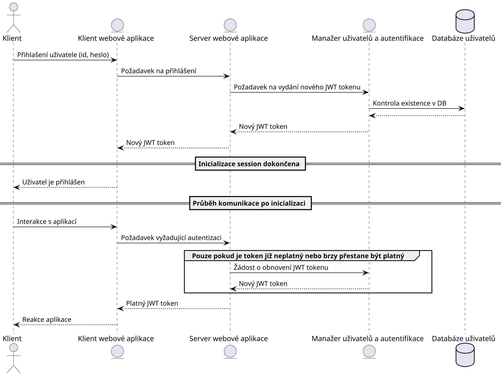
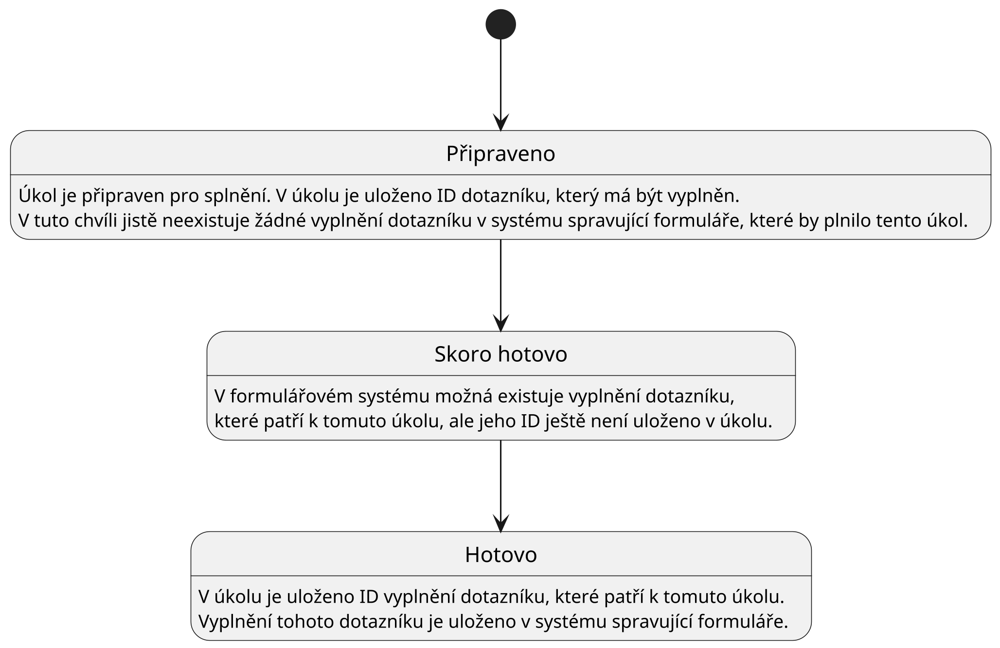

# Vývojová dokumentace

Na začátku kapitoly popíšeme zvolené nástroje pro vývoj aplikace
(sekce [Nástroje pro vývoj](#nástroje-pro-vývoj)). Také jsou zde popsány i
řešení menších problémů, které si vyžadují vysvětlení jako je řešení
autentizace, soukromí uživatelů apod.

## Nástroje pro vývoj

V této sekci popíšeme nástroje a knihovny a vysvětlíme proč jsme se rozhodli je
použít. Projekt využívá continuous integration (CI), což je postup, kdy vývojáři
projektu často (alespoň denně) integrují své změny do kódu projektu. Tyto změny
jsou provázeny kontrolní kompilací projektu a testováním, které pomáhají
předejít chybám. Projekt využívá CI konkrétně pro automatizování formátování
kódu, statickou analýzu kódu, generování dokumentace a testování. Jednotlivé
části CI pipeline jsou detailně popsány níže.

### [GitHub Workflows](https://github.com/features/actions)

Na základě dobré předchozí zkušenosti byl pro realizaci continuous integration
zvolen nástroj Github Workflows.

### [GitHub Issues](https://github.com/features/issues)

Pro issue tracking byl zvolen nástroj GitHub Issues, který je přímo integrován
do platformy GitHub.

### [Prettier](https://prettier.io/)

Standardizace formátování kódu zlepší čitelnost kódu a zrychlí vývoj. Manuální
formátování kódu je však zdlouhavé a proto použijeme nástroj, který tento proces
automatizuje. Na základě osobní zkušenosti byl zvolen nástroj Prettier s jeho
výchozím nastavením.

### [ESLint](https://eslint.org/)

Statická analýza kódu pomáhá předejít mnoha chybám a zvyšuje kvalitu kódu. Pro
tyto účely jsem zvážil nástroj ESLint a
[jshint](https://www.npmjs.com/package/jshint). Na základě pozitivní osobní
zkušenosti s nástrojem ESLint a jeho vyššímu počtu týdenních stažení na npm
registry byl zvolen nástroj ESLint.

### [CodeQL](https://codeql.github.com/)

Statická analýza kódu může pomáhat předejít i bezpečnostním chybám. Proto jsme v
projektu nasadili nástroj CodeQL, který je schopen detekovat bezpečnostní chyby
pomocí sémantické analýzy kódu. Každá změna v kódu musí projít kontrolou tímto
nástrojem než je sloučena do hlavní větve, pro zajištění maximální bezpečnosti.

### [Dependabot](https://github.com/dependabot)

Pravidelně probíhá kontrola všech závislostí nástrojem Dependabot, který
upozorňuje na známé bezpečnostní chyby v závislostech.

### [TypeDoc](https://typedoc.org/)

Tento nástroj implementuje generování dokumentace z dokumentačních komentářů dle
standardu [TSDoc](https://tsdoc.org/). Alternativou je
[DocFX](https://github.com/dotnet/docfx), který je napsaný v jazyce C\#. Tento
nástroj nemá npm balíček, což komplikuje integraci do našeho projektu. Pro tento
projekt byl zvolen TypeDoc, jelikož implementuje stejný standard a jeho použití
je v našem případě jednodušší.

### [Vitest](https://vitest.dev/)

Vývoj větších aplikací si vyžaduje testování kritických částí aplikace, abychom
předešli špatné uživatelské zkušenosti a bezpečnostním chybám. Původně byla pro
testování použita knihovna [Jest](https://jestjs.io/), ale konfigurace pro náš
projekt byla neúspěšná. Složité chybové hlášky a nedostatečná dokumentace vedly
na vykoušení jiné knihovnu. Byla zvolena knihovna Vitest, kterou bylo jednoduché
nakonfigurovat zejména díky kvalitní dokumentaci.

### [Docusaurus](https://docusaurus.io/)

Součástí požadavků na tento projekt je také dokumentace. Dokumentace usnadňuje
vývojářům orientaci v kódu a zachycuje důležitá rozhodnutí. Na začátku projektu
byla využívána
[Github Wiki](https://docs.github.com/en/communities/documenting-your-project-with-wikis/about-wikis),
ale časem se ukázalo, že je pro tento projekt nevhodná. Github Wiki chybí
podpora pro _diagrams-as-code_[^1] a také nelze zahrnout automaticky generovanou
dokumentaci z kódu. Proto byly zváženy další alternativy jako
[MkDocs](https://www.mkdocs.org/), [GitBook](https://www.gitbook.com/) a
[Docusaurus](https://docusaurus.io/). Docusaurus působí moderně, jednoduše a
všechny jeho funkce jsou zdarma. Docusaurus má mnoho rozšíření jako například
podporu pro diagramy jako kód. Docusaurus má oficiální plugin pro
[MermaidJS](https://mermaid.js.org/), což je nástroj pro tvorbu diagramů.
Ukázalo se, že MermaidJS není vhodný pro náš projekt, protože nemá dobrou
podporu [diagramů C4 modelu](https://c4model.com/), které používáme pro
dokumentaci architektury. Díky velkému ekosystému nástroje Docusaurus však
existuje i komunitní plugin pro podporu [PlantUML](https://plantuml.com/)
diagramů, který má skvělou podporu diagramů C4 modelu. Integrace PlantUML
diagramů s GitBook je naopak poměrně komplikovaná, proto GitBook nebyl použit.
MkDocs a Docusaurus jsou srovnatelné, ale Docusaurus má některé funkce navíc
jako např. použití React komponent pro tvorbu interaktivních částí. Přestože
tyto funkce pravděpodobně nevyužijeme, nakonec byl zvolen nástroj Docusaurus.

## Soukromí uživatelů

Aplikace pracuje s citlivými daty a proto je pro nás bezpečnost na prvním místě.
Tato sekce se věnuje krokům, které jsme podnikli pro zajištění maximální
bezpečnosti a soukromí uživatelů.

Uživatelé v systému vystupují pod náhodně generovaným ID, aby i v případě úniku
dat nebylo možné získat citlivé informace o uživatelích.

Po všech uživatelích vyžadujeme silná hesla, která jsou bezpečně uložena. Pro
řešení autentizace byly zváženy i bezheslové metody autentizace jako použití
biometrických údajů, magic links či jednorázových tokenů. Tyto metody však nelze
v naší aplikaci využít z následujících důvodů. Chybí nám informace jako email,
telefonní číslo apod. Nechceme po uživateli vyžadovat vlastnictví
specializovaného hardware jako
[bezpečnostní token](https://cs.wikipedia.org/wiki/Bezpe%C4%8Dnostn%C3%AD_token)
či skener otisku prstu.

Webové rozhraní používající knihovnu NextJS ve výchozím nastavení sbírá anonymní
data o uživatelích. Na dotaz zadavatele byl sběr těchto dat vypnutý pro zvýšení
důvěry uživatelů v platformu (viz produkční Dockerfile kontejneru `web-app`).

Dle vyjádření správců projektu Form.io software Form.io nesbírá žádná data o
uživatelích.

### GDPR

Při autentizaci uživatele používáme cookies pro správu session. Ukládání dat do
úložiště klienta spadá pod
[GDPR](https://eur-lex.europa.eu/eli/reg/2016/679/oj), proto je nutno ověřit,
jaké jsou naše povinnosti. Dle
[doporučení Evropské Unie (sekce 3.2)](https://ec.europa.eu/justice/article-29/documentation/opinion-recommendation/files/2012/wp194_en.pdf)
pro autentizační cookies je potřeba pro _persistentní_ cookies upozornit
uživatele o jejich užití. Knihovna NextAuth.js, kterou používáme má podporu
pouze pro persistentní cookies (viz
[issue](https://github.com/nextauthjs/next-auth/issues/2534)), tedy musíme
uživatele řádně upozornit. Pro tento účel jsem zvolil knihovnu
[react-cookie-consent](https://www.npmjs.com/package/react-cookie-consent).

GDPR také vyžaduje, aby uživatelé měli možnost smazat svá data. Existuje však
výjimka ohledně ukládání vědeckých dat. Dle vyjádření NUDZ jsou veškerá data,
která ukládáme slouží mimo jiné pro vědecké účely.

## Autentizace

Jak bylo vysvětleno v sekci [Soukromí uživatelů](#soukromí-uživatelů), tak
uživatelé se přihlašují pomocí náhodně generovaného ID a hesla. Administrátoři
se přihlašují pomocí emailu a hesla. Pro autentizaci se používá knihovna
NextAuth.js, která vykonává kód jak na klientovi, tak na serveru webové
aplikace. Tato knihovna má vlastní session management a vydává JWT tokeny. Aby
klient mohl pracovat se systémem spravující formuláře, je potřeba získat JWT
token systému spravující formuláře. Token systému spravující formuláře je vložen
do tokenu vydávaného knihovnou NextAuth.js. Tento systém zařizuje, že webová
aplikace nemusí při každém požadavku od klienta komunikovat s systémem
spravující formuláře, ale má vlastní session. Kontrola práv uživatele při
přístupu na ochráněnou stránku se kontrola provádí v middleware NextJS serveru.

### Komunikace při autentizaci uživatele

## Konfigurace a modifikace Form.io

[Submodul](https://git-scm.com/book/en/v2/Git-Tools-Submodules) `/src/formio/`
obsahuje fork projektu Form.io, kde bylo provedeno několik úprav. Úpravy jsou
poměrně malé a jejich cílem je přizpůsobit software našim potřebám. Všechny
změny jsou popsány v této sekci. Dále jsou zde popsány některé části konfigurace
Form.io.

### Modifikace

#### Inicializace projektu

První úprava se týká inicializace instance při prvním startu. Nepodařilo se
najít způsob, jak nastavit inicializaci projektu tak, aby se automaticky
vytvořili všechny potřebné zdroje (klient, pacient, zaměstnanec, apod.), role
(admin, zaměstnanec, apod.). Proto jsem upravil kód inicializace tak, aby se
načetla z souboru `project.json` z kořenu repozitáře obsahující fork. Původně se
načítala z `project.json` v build složce, která však není uložena ve verzovacím
systému. Tato úprava byla nutná, jelikož nelze vytvářet nové role po
inicializaci projektu a konfigurační soubor je nutné zahrnout do verzovacího
systému.

#### Webhook action

Webhook je koncept, který umožňuje poslat HTTP požadavek na zadanou URL jako
reakci na určitou událost. V našem případě se jedná o události jako je vytvoření
nebo smazání formuláře. V open-source verzi Form.io software je tato funkce
podporována, ale neumí přeposílat hlavičky HTTP dotazu, který požadavek
inicioval. Tuto funkcionalitu potřebujeme, jelikož chceme přeposílat
autentizační hlavičky při komunikaci mezi systémem spravující formuláře a
systémem spravující úkoly uživatelů. Detaily ohledně této komunikace jsou
popsány v
sekci [Propojení správy úkolů a správy formulářů](#propojení-správy-úkolů-a-správy-formulářů).
Proto jsem upravil tuto funkci tak, aby bylo možné přeposílat autentizační
hlavičky.

#### Imutabilita ID uživatele

Form.io software lze rozdělit na dvě části. První část je systém pro správu
formulářu a sbírání odpovědí na tyto formuláře. Druhá část je systém pro správu
uživatelů. Systém správy formulářů je použit i pro správu uživatelů systému. V
systému jsou vytvořeny registrační formuláře, které umožňují tvorbu
uživatelských účtů. Data o uživatelských účtech jsou pak uložena v uložišti
odpovědí na tyto registrační formuláře. V systému existují samosatné registrační
formuláře pro různé role uživatelů. My potřebujeme zajistit imutabilitu
identifikátoru každého uživatele, který je uložen v položce `data.id`. Motivaci
k této změně naleznete v sekci [Autentizace](#autentizace). Databáze
[MongoDB](https://www.mongodb.com/), která je použita pro ukládání dat o
uživatelích neumí zajistit imutabilitu ukládaných dat. Form.io však vždy
přistupuje k databázi uživatelů skrze knihovnu
[Mongoose](https://mongoosejs.com/). Tato knihovna umí zajistit imutability
zvolených položek. Mongoose nastavíme tak, aby zajistil imutabilitu položky
`data.id` (ID uživatele). Pokud se uživatel pokusí změnit své ID v rámci úpravy
svého profilu, tak se změna neprovede. Nevýhodou tohoto řešení je, že vytváří
omezení na položky `data.id` ve všech objektech reprezentující odevzdání, tedy i
v těch, které nejsou uživatelské účty.

Alternativní řešení by bylo vytvořit autorizační proxy mezi klientem a Form.io
serverem či mezi Form.io serverem a databází uživatelů. Toto řešení by
pravděpodobně vyžadovalo další kontejner a má netriviální implementaci.
Implementace by navíc měla nízkou odolnost vůči změnám. Pokud bychom měli více
koncových bodů API, které umožňují modifikovat entitu uživatele, bylo by potřeba
myslet na zabezpečení všech koncových bodů. V případě přidání nového bodu, by
bylo vždy potřeba myslet na úpravy autorizační proxy. Z těchto důvodů byla tato
alternativa zavrhnuta a bylo použito řešení popsáno v předchozím odstavci.

### Konfigurace

Tato podsekce popisuje, jak byl software Form.io nakonfigurován pro náš projekt.

#### Konfigurace zdrojů (resources)

Form.io pracuje s konceptem zdrojů, které lze zjednodušeně chápat jako kolekce
objektů v databázi. Detailní popis tohoto konceptu lze nalézt v
[dokumentaci Form.io](https://help.form.io/userguide/resources). Pro nás je nyní
důležité, že každý objekt patří do právě jednoho zdroje. Toto omezení platí,
protože používáme bezplatnou verzi Form.io. Uživatelé jsou reprezentováni jako
objekty patřící do nějakého zdroje. Každý zdroj je svázán se sadou rolí. Role
uživatele jsou tedy určeny zdrojem, kterému uživatel patří. Proto je potřeba
vytvořit zdroj pro každou kombinaci rolí, které může uživatel mít. Vzhledem k
tomu, že jsou tyto zdroje oddělené, nelze při tvorbě uživatelského účtu
jednoduše validovat, že má každý uživatel unikátní ID pro přihlášení. Abychom
předešli zmatení uživatelů, v uživatelském rozhraní vždy k ID přidáme i roli,
která je uživateli přiřazena.

Alternativně bychom mohli každé existující kombinaci rolí přidat prefix do ID
uživatele. Toto řešení však značně zhoršuje uživatelskou přívětivost a proto
nebylo použito.

## Propojení správy úkolů a správy formulářů

Náš systém obsahuje komponentu spravující úkoly a komponentu spravující
formuláře. Každý úkol je spojen s formulářem, který má uživatel vyplnit.
Potřebujeme v našem distribuovaném systému zajistit, aby uživatel mohl vyplnit
dotazník pouze tehdy, když má úkol na jeho vyplnění. Popíšeme dvě možnosti
řešení tohoto problému a následně zvolíme jednu z nich.

První možností řešení je, že uživatel vyplní dotazník a _odešle se požadavek na
komponentu spravující formuláře_, kde je připraven webhook, který proběhne
_před_ uložením výsledku, kde proběhne kontrola existence úkolu na vyplnění
tohoto dotazníku. Pokud úkol existuje, tak se vyplnění dotazníku uloží společně
s identifikátorem úkolu a také se splní úkol a uloží se k němu identifikátor
vyplnění dotazníku. V případě, že úkol neexistuje, tak se vyplnění dotazníku
neuloží a uživatel je informován o chybě. Dotazník obsahuje skryté pole, které
obsahuje identifikátor úkolu v rámci, kterého byl dotazník vyplněn. Tím je
zajištěno, že vyplnění dotazníku drží informaci o identifikátoru úkolu v rámci
kterého byl vyplněn.

Zvažme nyní druhou možnost řešení. Uživatel vyplní dotazník a _odešle se
požadavek na komponentu spravující úkoly_, která za něj dotazník odevzdá pokud
má uživatel úkol na jeho vyplnění. Situace se při tomto řešení komplikuje,
jelikož bychom museli zajistit, že všechny požadavky na vyplnění dotazníku musí
jít skrze komponentu spravující úkoly. Museli bychom tedy zakázat, aby uživatel
odevzdal dotazník přímo do systému spravující formuláře. Kdybychom to neudělali,
tak nejsme schopni zajistit integritu sesbíraných dat. Toto omezení bychom mohli
zajistit úpravou konfigurace reverse proxy, kterou prochází všechny požadavky z
vnějšího světa, nebo úpravou systému spravující formuláře. První zmíněný způsob
by však nezajistil ochranu před požadavky z vnitřní sítě. Pro ochranu před
požadavky z vnitřní sítě je lepší druhý způsob. Systém spravující formuláře je
řešením třetí strany a vyžadovalo by to zásah do jejich kódu.

Zvolíme první alternativu, jelikož je jednodušší na implementaci a má dobré
vlastnosti. Nyní si rozmysleme detaily implementace. Chceme zajistit, aby se nám
nepodařilo vytvořit více vyplnění dotazníku pro stejný úkol. Proto formulář,
který bude zadáván jako úkol pro plnitele, nastavíme tak, aby zajistil
unikátnost hodnoty skryté položky obsahující identifikátor úkolu. Nyní popíšeme
celý proces vyplnění dotazníku formou diagramu používající
[Business Process Model and Notation](https://www.bpmn.org/).

### Diagram integrace systémů spravující úkoly a systému spravující formuláře

Požadavek na uložení vyplnění dotazníku spustí webhook. V rámci reakce na tento
webhook uvedeme úkol do stavu `skoro hotový`. Tento stav slouží k tomu, aby
nebylo možné vytvořit další vyplnění dotazníku v rámci stejného úkolu. Tento
mechanismus se nazývá _semantic lock counter-measure_. Stavy úkolu a přechody
mezi nimi jsou popsány stavovým diagramem v jazyce UML na obrázku níže.

Nyní popíšeme, jak je tento mechanismus využíván v našem systému. Pokud
požadavek na uložení vyplnění dotazníku spustí webhook, který proběhne před
uložením do systému spravující formuláře, a následně selže operace uložení
vyplnění dotazníku v systému spravující formuláře, tak úkol navždy zůstane ve
stavu `skoro hotový`. Pokud bychom se z tohoto stavu chtěli dostat, potřebovali
bychom implementaci [ság](https://microservices.io/patterns/data/saga.html),
která by zajistila provedení kompenzačních transakcí. Popsaná situace je však
natolik výjimečná, že se v tuto chvíli problematice věnovat nebudeme. Vystačíme
si s tím, že systém spravující formuláře nikdy nebude obsahovat vyplnění
dotazníku, které vzniklo bez zadání úkolu.

#### Stavový diagram úkolů

Po uložení vyplnění dotazníku se zavolá druhý webhook, který zařídí uložení
informace o identifikátoru vyplnění do úkolu. Vzhledem k tomu, že se jedná o
veřejně dostupný endpoint, tak je nutné ověřit poskytnutá data. Musíme si tedy z
úkolového systému vyžádat vyplnění dotazníku a zkontrolovat všechny náležitosti.
Pokud by se někdo pokusil spárovat úkol s formulářem, který je ve stavu
`skoro hotový` na jiné vyplnění dotazníku než to, které způsobilo přechod úkolu
do stavu `skoro hotový`, tak operace jistě selže. Kdyby se někdo pokusil
spárovat úkol s vyplněním dotazníku, který neodpovídá dotazníku zadaný úkolem,
tak operace jistě selže. V případě, že by se někdo pokusil spárovat jiné
vyplnění stejného dotazníku, tak se mu to také nepovede. Ono jiné vyplnění
dotazníku by muselo mít jiný identifikátor úkolu v skrytém poli, protože systém
spravující formuláře zajišťuje unikátnost těchto hodnot. Jelikož víme, že již
existuje vyplnění dotazníku, které má identifikátor úkolu v skrytém poli stejné
jako identifikátor úkolu, který se právě snažíme napárovat, tak víme, že
jakékoliv jiné vyplnění stejného dotazníku bude mít jiný identifikátor úkolu v
skrytém poli.

##### Autentizace webhooků

HTTP požadavky, které dělá systém spravující formuláře při tvorbě odevzdání
formuláře na systém spravující úkoly, musí obsahovat autentizační hlavičky.
První možností je poskytnout systému spravující formuláře speciální přístupový
token. Toto však nelze provést pouze pro některé webhooky bez většího zásahu do
zdrojového kódu systému spravující formuláře, ale pouze pro všechny webhooky
najednou. Navíc to situaci zbytečně komplikuje.

Druhá možnost je využití JWT tokenu z požadavku na vytvoření odevzdání
formuláře, který je přijat systémem spravující formuláře. Toto je dobrá možnost,
ale open-source verze systému spravující formuláře tuto funkci nemá. Nicméně
není těžké ji do něj přidat.

Třetí možností je vyhnout se autentizaci webhooku pomocí přihlášení. Místo toho
bychom mohli vytvořit endpoint komponenty spravující úkoly, který je přístupný
pouze z komponenty spravující formuláře. Toto však znamená netriviální úpravy
síťové infrastruktury. Tyto úpravy jsou poměrně špatně udržovatelné.

Použijeme druhou možnost, jelikož má jednoduchou implementaci. Provedené úpravy
systému spravující formuláře jsou popsány v
sekci [Konfigurace a modifikace Form.io](#konfigurace-a-modifikace-formio).
