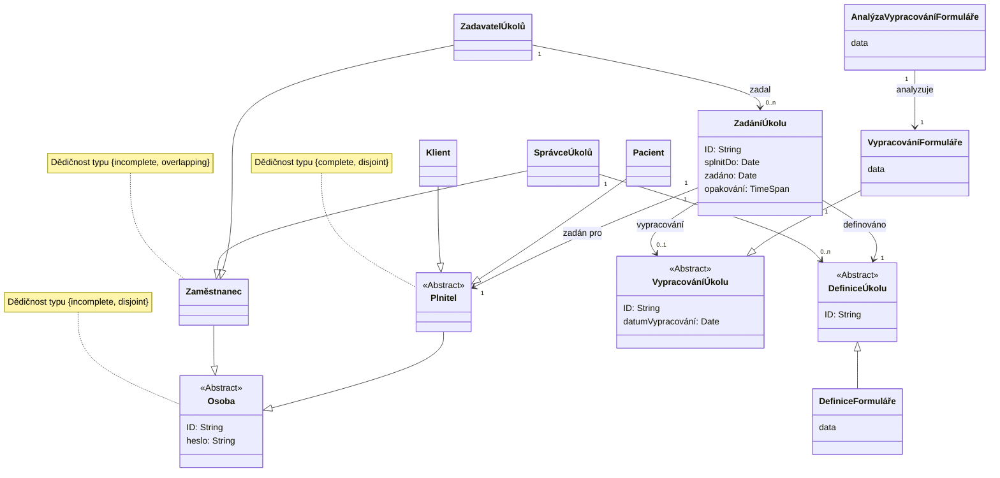

## Diagram



:::note

Dědičnost v UML vyjadřuje jiný vztah než v programování. Třída je množina a
odvozená třída je její podmnožina. Vztahy mezi odvozenými třídami, tedy
podmnožinami, mohou být 4 typů podle toho zda-li se podmnožiny překrývají a
zda-li je jejich sjednocení množina definovaná třídou, od které odvozujeme.
Tento vztah je vždy popsán v poznámce k třídě, od které odvozujeme.

:::

## Definice entit

### Osoba

Lidská bytost, která má vztah k systému.

### Zaměstnanec

Osoba, která je zaměstnána v NUDZ.

### SprávceÚkolů

Zaměstnanec, který je zodpovědný za správu úkolů v systému.

### ZadavatelÚkolů

Zaměstnanec, který zadává plnitelům úkoly v systému.

### Plnitel

Osoba, která vypracovává úkoly v systému.

### Klient

Plnitel, který je klientem NUDZ (platí za poskytovanou péči).

### Pacient

Plnitel, který je pacientem NUDZ (poskytovaná péče je hrazena pojišťovnou).

### DefiniceÚkolu

Obecný potenciálně znovupoužitelný popis činnosti plnitele.

### DefiniceFormuláře

Definice úkolu, která obsahuje formulář, který je určen k vyplnění plnitelem.

### ZadáníÚkolu

Zadání úkolu pro konkrétního plnitele na základě definice úkolu.

### VypracováníÚkolu

Vypracování úkolu plnitelem na základě zadání úkolu.

### VypracováníFormuláře

Vypracování úkolu ve tvaru vyplnění formuláře.

### AnalýzaVypracováníFormuláře

Analýza vypracování formuláře, která je určena k uložení odvozených dat.

## Omezení

### ZadáníÚkolu

-   Definice úkolu musí logicky odpovídat vypracování úkolu. Např. nemůžeme
    považovat přečtení článku jako vypracování úkolu, který je definován jako
    vypracování formuláře.
    ```
    context z: ZadáníÚkolu inv
        if vypracování.oclIsKindOf(VypracováníFormuláře) then
            definováno.oclIsKidnOf(DefiniceFormuláře)
        endif
    ```

### VypracováníÚkolu

-   ID musí být unikátní.
    ```
    context v1, v2: VypracováníÚkolu inv v1.ID = v2.ID implies v1 = v2
    ```

### DefiniceÚkolu

-   ID musí být unikátní.
    ```
    context d1, d2: DefiniceÚkolu inv d1.ID = d2.ID implies d1 = d2
    ```

### Osoba

-   ID musí být unikátní.
    ```
    context o1, o2: Osoba inv o1.ID = o2.ID implies o1 = o2
    ```
