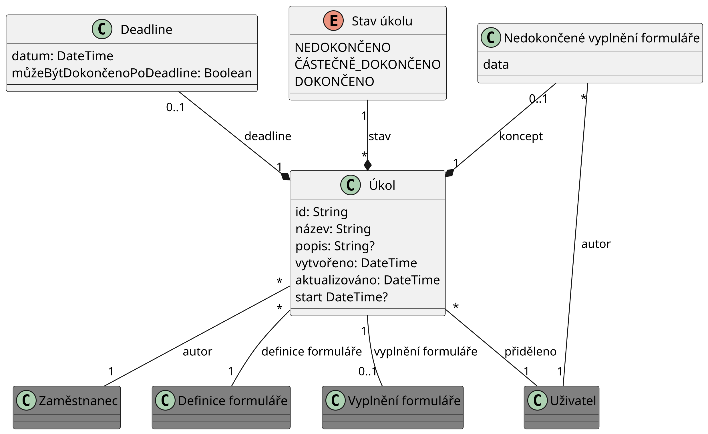

Nyní popíšeme jak data budete ukládat na logické úrovni. Nebudeme se však
zabývat detaily ukládání dat o uživatelích a formulářích, jelikož o to se stará
software Form.io. Entity, jejich reprezentací se nechceme zabývat jsou označeny
šedou barvou. Budeme se zabývat ukládáním úkolů a částečných vyplnění formulářů.
Zvolme relační datový model pro modelování těchto dat. Třídy v UML diagramu
budou reprezentovat tabulky v databázi.

