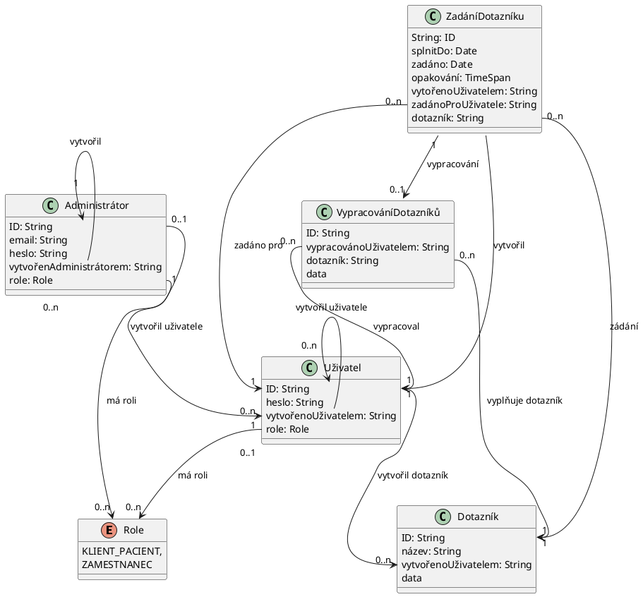

Entita _ZadáníDotazníků_ používá relační datový model. Ostatní entity používají
hierarchický datový model. Navzdory rozdílu v datových modelech, jsou všechny
entity v jednom diagramu pro přehlednost.
