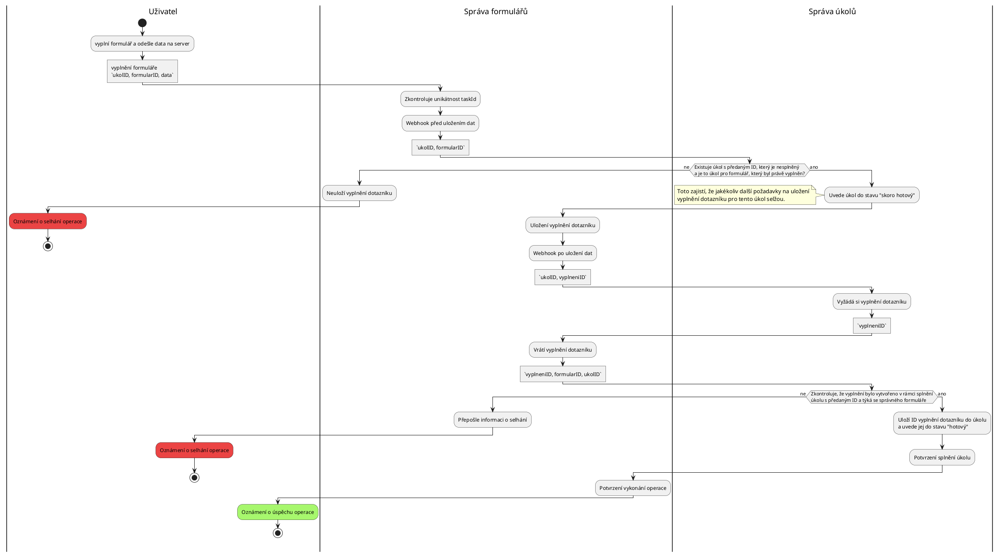
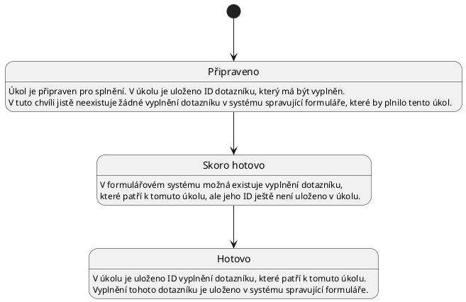

Potřebujeme propojit komponentu starající se o úkolu a komponentu starající se o
dotazníky. Zde je seznam požadovaného chování:

-   Úkol drží informaci o ID vyplnění dotazníku splnění úkolu (vhodné pro UI).
-   Dotazník drží informaci o ID úkolu v rámci kterého byl vyplněn (vhodné pro
    UI).
-   Uživatel může vyplnit dotazník, právě tehdy když má dotazník ve svých
    úkolech (integrita dat).

## Řešení

### Alternativa 1

Uživatel vyplní dotazník a _odešle se požadavek na komponentu spravující
formuláře_, kde je webhook, který proběhne _před_ uložením výsledku, kde
proběhne kontrola existence úkolu na vyplnění tohoto dotazníku. Pokud úkol
existuje, tak se vyplnění dotazníku uloží společně s identifikátorem úkolu a
také se splní úkol a uloží se k němu identifikátor vyplnění dotazníku.

Aktuálně však dotazník nedrží informaci o tom v rámci kterého úkolu byl vyplněn.
To bychom mohli vyřešit zavédením následujícího omezení: "Každý uživatel má
zadaný vždy maximálně jeden úkol na vyplnění jednoho dotazníku". Díky tomuto
omezení je jednoznačné, kterého úkolu se vyplnění týká. Druhá možnost je v
dotazníku vytvořit skryté pole, které obsahuje identifikátor úkolu v rámci,
kterého byl dotazník vyplněn. Tím zajistíme, že dotazník drží informaci o
identifikátoru úkolu v rámci kterého byl vyplněn. Zvolme tedy druhou možnost.

Zvolme tedy druhou možnost.

### Alternativa 2

Uživatel vyplní dotazník a _odešle se požadavek na komponentu spravující úkoly_,
která za něj dotazník odevzdá pokud má uživatel úkol na jeho vyplnění. Situace
se při tomto řešení komplikuje, protože bychom museli přidat autentifikační
proxy před API endpoint pro odevzdávání úkolů, jelikož ten je veřejně dostupný a
my chceme zajistit, aby všechny požadavky musely jít skrze komponentu spravující
úkoly. Museli bychom tedy zakázat, aby uživatel odevzdal dotazník přímo.
Kdybychom to neudělali, tak nejsem schopni zajistit integritu sesbíraných dat.
To je příliš složité a tato nová komponenta by byla silně závislá na komponentě
spravující formuláře.

### Finální implementace

Zvolíme první alternativu, jelikož je jednodušší na implementaci a má lepší
vlastnosti. Nyní si rozmysleme detaily implementace. Formulářový systém
nastavíme tak, aby zajistil unikátnost hodnoty skryté položky obsahující
identifikátor úkolu. Proč toto nastavení potřebujeme uvidíme při pokusu o
narušení integrity dat v systémech. První se podívejme se na diagram aktivit:

V rámci reakce na první webhook uvedeme úkol do stavu "skoro hotový". Tento stav
slouží k tomu, aby nebylo možné vytvořit další vyplnění dotazníku v rámci
stejného úkolu. Jelikož pokud tento požadavek na úkolový systém selže,
formulářový systém neuloží vyplnění dotazníku do systému. Tento mechanismus se
nazývá _semantic lock counter-measure_ dle [tohoto článku][sagas_article].

Po uložení vyplnění dotazníku se zavolá druhý webhook, který zařídí uložení
informace o identifikátoru vyplnění do úkolu. Vzhledem k tomu, že se jedná o
veřejně dostupný endpoint, tak je nutné ověřit poskytnutá data. Musíme si tedy z
úkolového systému vyžádat vyplnění dotazníku a zkontrolovat všechny náležitosti.
Pokud by se někdo pokusil napárovat úkol, který je ve stavu "skoro hotový" na
jiné vyplnění dotazníku než to, které způsobilo přechod úkolu do stavu "skoro
hotový", tak se mu to jistě nepovede. Pokud by se pokusil napárovat vyplnění
jiného dotazníku, tak to selže, jelikož to úkolový systém kontroluje. Pokud by
se pokusil nápárovat jiné vyplnění stejného dotazníku, tak se mu to také
nepovede, jelikož toto jiné vyplnění dotazníku by muselo mít jiný identifikátor
úkolu v skrytém poli, protože formulářový systém zajišťuje, že tyto hodnoty jsou
v každém vyplnění (jednoho dotazníku) unikátní. Jelikož víme, že již existuje
vyplnění dotazníku, které má identifikátor úkolu v skrytém poli stejné jako
identifikátor úkolu, který se právě snažíme napárovat, tak víme, že jakékoliv
jiné vyplnění stejného dotazníku bude mít jiný identifikátor úkolu v skrytém
poli.

#### Autentifikace webhooku

První možnost je poskytnout webhooku speciální přístupový token. Toto však nelze
provést pouze pro jeden webhook, ale pouze pro všechny webhooky v formulářovém
systému bez většího zásahu do zdrojového kódu formulářového systému. Navíc to
situaci zbytečně komplikuje.

Druhá možnost je využití JWT tokenu z požadavku na formulářový systém. Toto je
dobrá možnost, ale open-source verze formulářového systému tuto funkci nemá.
Nicméně není těžké ji do něj přidat.

Třetí možností je vyhnout se autentifikaci webhooku pomocí přihlášení. Místo
toho bychom mohli vytvořit endpoint komponenty spravující úkoly, který je
přístupný pouze z komponenty spravující formuláře. Toto však znamená netriviální
úpravy síťové infrastruktury. Tyto úpravy jsou poměrně špatně udržovatelné.

## Stavy úkolu

Pokud požadavek na uložení vyplnění dotazníku spustí webhook, který proběhne
před uložením do systému spravující formuláře, a následně selže operace uložení
vyplnění dotazníku v systému spravující formuláře, tak se úkol dostane do
neřešitelného stavu. Z tohoto stavu se nelze dostat. Pokud bychom se z něj
chtěli dostat, potřebovali bychom komplexnější implementaci
[ság][saga_definition], která zahrnuje implementaci kompenzačních transakcí.
Popsaná situace je však natolik vyjímečná, že se v tuto chvíli problematice
věnovat nebudeme. Vystačíme si s tím, že formulářový systém nikdy nebude
obsahovat vyplnění dotazníku, které vzniklo bez zadání úkolu.

[sagas_article]:
    https://microservices.io/post/microservices/2019/07/09/developing-sagas-part-1.html
[saga_definition]: https://microservices.io/patterns/data/saga.html
