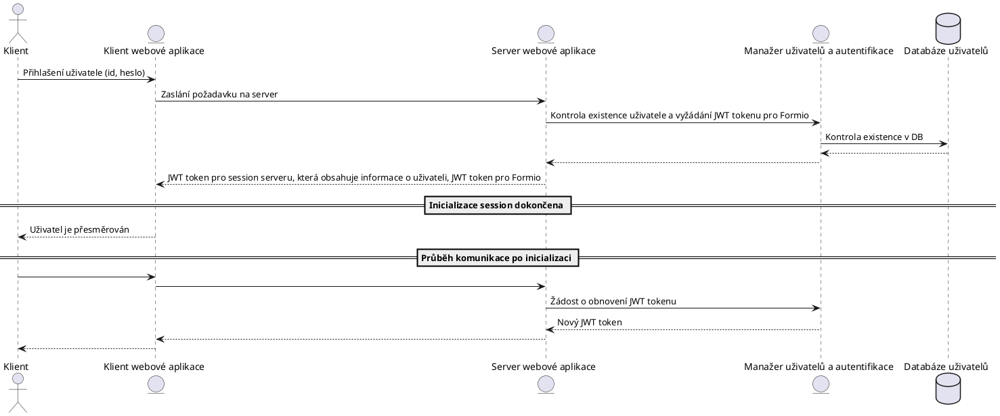

Uživatelé (klienti, pacienti a zaměstnanci) se přihlašují pomocí ID a hesla.
Administrátoři se přihlašují pomocí e-mailu a hesla. Pro autentifikaci se
používá knihovna NextAuth, která vykonává kód jak na klientovi, tak na serveru
webové aplikace. Tato knihovna má vlastní session management a vydává JWT
tokeny. Aby klient mohl pracovat se systémem formulářů, je potřeba získat JWT
token formulářového systému. Tento token se automatický získá při přihlášení
přes NextAuth a umístí se do tokenu webové aplikace. Při odhlášení se
automatický deaktivuje token formulářového systému. Tento systém zařizuje, že
webová aplikace nemusí při každém požadavku od klienta komunikovat s
formulářovým systémem, ale má vlastní session.

Kontrola práv uživatele při přístupu na ochráněnou stránku se kontrola provádí v
middlewaru NextJS serveru. Pokud uživatel nemá dostatečná práva, je přesměrován
na `/403`.

Životnost jednoho tokenu musí být stejná nebo nižší než životnost tokenu
vydaného formulářovým systémem (viz [Formio](../Formio/Autentifikace.md)).

