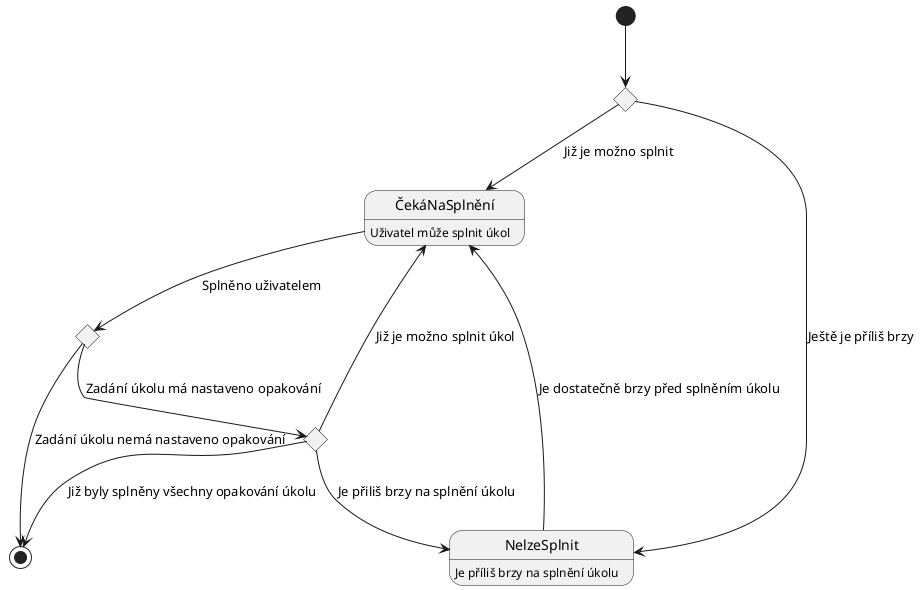

Tento diagram neodpovídá tomu, co je aktuálně implementováno. Podpora pro časové
omezení plnění úkolů a opakování úkolu bude přidána v budoucnu.

```plantuml
@startuml

state c1 <<choice>>
state c2 <<choice>>
state c3 <<choice>>

[*] --> c1
c1 --> ČekáNaSplnění : Již je možno splnit
c1 --> NelzeSplnit : Ještě je příliš brzy


ČekáNaSplnění --> c2 : Splněno uživatelem
c2 --> [*]: Zadání úkolu nemá nastaveno opakování
c2 --> c3: Zadání úkolu má nastaveno opakování
c3 --> NelzeSplnit: Je přiliš brzy na splnění úkolu
c3 --> ČekáNaSplnění: Již je možno splnit úkol
c3 --> [*]: Již byly splněny všechny opakování úkolu
ČekáNaSplnění: Uživatel může splnit úkol
NelzeSplnit: Je příliš brzy na splnění úkolu
NelzeSplnit --> ČekáNaSplnění : Je dostatečně brzy před splněním úkolu

@enduml
```
